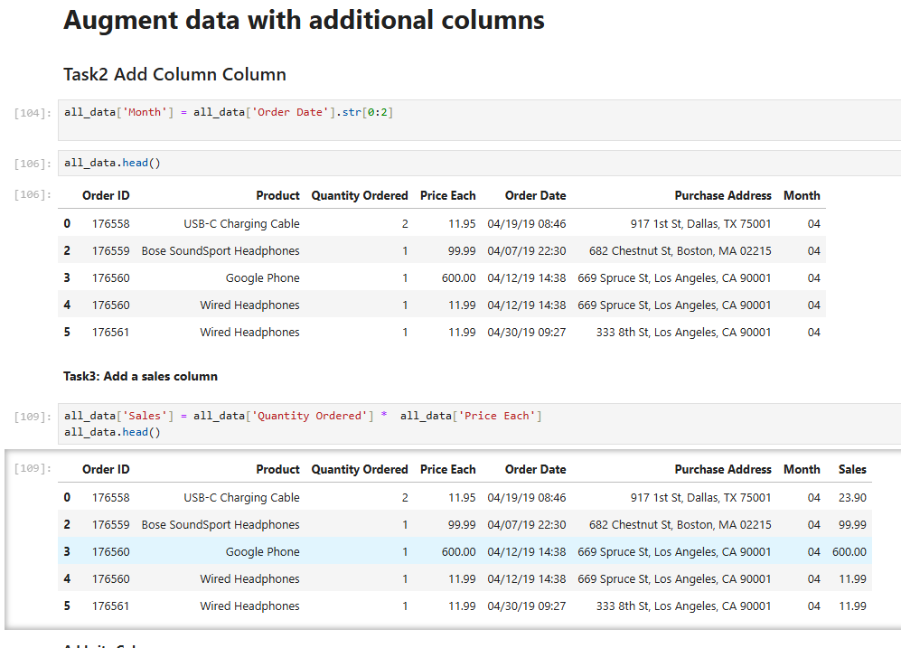
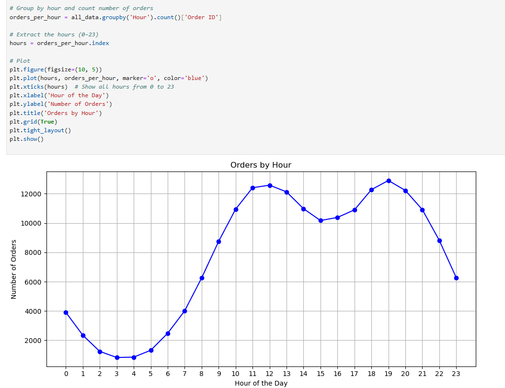

"# sales-analysis" 

---

## ✅ Key Features

### 🧹 Data Cleaning with Pandas

- Merged 12 monthly CSV files into one DataFrame
- Removed null rows and incorrect entries (like headers in data)
- Converted columns to proper data types (`int`, `float`, `datetime`)
- Extracted new columns:
  - `Month` from `Order Date`
  - `City` from `Purchase Address`
  - `Hour` and `Minute` from `Order Date`
  - `Sales` = Quantity × Price

### 📊 Visualization with Matplotlib

- **Sales by Month** – find the most profitable month
- **Sales by City** – understand which cities generate the most revenue
- **Orders by Hour** – determine the best time to advertise
- **Product Bundles** – most common product combinations
- **Quantity vs Price** – compare popularity vs pricing

---

## 📈 Example Visual

### 📊 Quantity Ordered vs. Average Price per Product

This chart shows which products sell most and their average prices.


---

## 📌 Key Business Insights

- **San Francisco** had the highest total sales
- **Evening time (7 PM)** is the best time to target customers with ads
- **Low-cost items** sell in large volume (e.g., USB-C cables, AAA batteries)
- **iPhone and Lightning Cables** are often purchased together

---

## 🛠 Tools & Technologies

- Python 🐍
- Pandas
- Matplotlib
- Jupyter Notebook

---

### 📊 Column Chart Code



---

### 📈 Line Chart Code




## 🚀 How to Run

1. Clone the repository:

```bash
git clone https://github.com/Jaideep0710/sales-analysis.git
cd sales-analysis
